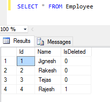
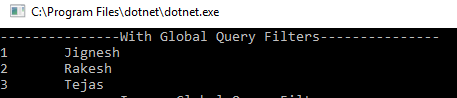
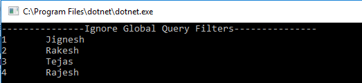

### Introduction
This feature is also refer as Model-level query filters. It allows to specify filter in the model level that are automatically applied to all queries that executed on the context on the specified type. It means that entity framework automatically adds the filter in where clause before executing the LINQ queries. Usually Global query filters are applied in OnModelCreating method of context. This filters are also automatically applied to LINQ queries involving the entity types referenced indirectly like included as navigation property.

### Common use of this feature are
* Soft delete - An Entity Type defines an IsDeleted property and application does not required deleted data.
* Multi-tenancy - An Entity Type defines a TenantId property

#### Example
The following example shows, how to applied global query filter to implement soft-delete. To demostrate the example, I have create Employee table and it has IsDeleted column that is used to define whether record is deleted or not.
```
SET ANSI_NULLS ON
GO
SET QUOTED_IDENTIFIER ON
GO
SET ANSI_PADDING ON
GO
CREATE TABLE [dbo].[Employee](
	[Id] [int] NOT NULL,
	[Name] [varchar](50) NULL,
	[IsDeleted] [bit] NULL,
 CONSTRAINT [PK_Employee] PRIMARY KEY CLUSTERED 
(
	[Id] ASC
)WITH (PAD_INDEX = OFF, STATISTICS_NORECOMPUTE = OFF, IGNORE_DUP_KEY = OFF, ALLOW_ROW_LOCKS = ON, ALLOW_PAGE_LOCKS = ON) ON [PRIMARY]
) ON [PRIMARY]

GO
SET ANSI_PADDING OFF
GO
INSERT [dbo].[Employee] ([Id], [Name], [IsDeleted]) VALUES (1, N'Jignesh', 0)
INSERT [dbo].[Employee] ([Id], [Name], [IsDeleted]) VALUES (2, N'Rakesh', 0)
INSERT [dbo].[Employee] ([Id], [Name], [IsDeleted]) VALUES (3, N'Tejas', 0)
INSERT [dbo].[Employee] ([Id], [Name], [IsDeleted]) VALUES (4, N'Rajesh', 1)
```



First define entities and context class

Employee.cs
```
using System.ComponentModel.DataAnnotations;
using System.ComponentModel.DataAnnotations.Schema;

namespace GlobalFilterExample.Model
{
    [Table("Employee")]
    public class Employee
    {
        [Key]
        public int Id { get; set; }
        public string Name { get; set; }
        public bool IsDeleted { get; set; }
    }
}
```

EntityModelContext.cs
```
using Microsoft.EntityFrameworkCore;
using System;

namespace GlobalFilterExample.Model
{
    public class EntityModelContext : DbContext
    {
        protected override void OnConfiguring(DbContextOptionsBuilder optionsBuilder)
        {
            optionsBuilder.UseSqlServer(@"Server=(local);Database=Test;user Id=sa; password=Passwd@12;");
        }

        protected override void OnModelCreating(ModelBuilder modelBuilder)
        {
            base.OnModelCreating(modelBuilder);
        }

        public DbSet<Employee> Employees { get; set; }
    }
}
```
Next step, configure the global query filter in OnModelCreating  method of context class. Using HasQueryFilter API, we can applied global filter on entity type.
```
protected override void OnModelCreating(ModelBuilder modelBuilder)
{
    modelBuilder.Entity<Employee>()
        .HasQueryFilter(p => !p.IsDeleted);

    base.OnModelCreating(modelBuilder);
}
```
The expression passed in HasQueryFilter method is automatically applied to any LINQ queries for Employee Type.

Example code
```
using (EntityModelContext context = new EntityModelContext())
{
    Console.WriteLine("---------------With Global Query Filters---------------");
    var data = context.Employees.ToList();
    foreach (var d in data)
    {
        Console.WriteLine("{0}\t{1}", d.Id, d.Name);
    }

    Console.ReadLine();
}
```
Output


Disabling Global Filters
The global filters are applied any LINQ query. In some cases, we do not required these filters. The global filters may be disabled for individual LINQ queries by using the IgnoreQueryFilters() method.

Example
```
var data1 = context.Employees
    .IgnoreQueryFilters().ToList();
foreach (var d in data1)
{
    Console.WriteLine("{0}\t{1}", d.Id, d.Name);
}
```
Output


### Limitations
It has following Limitation
* It cannot contain references to navigation properties
* It can defined only at root Entity Type of an inheritance hierarchy
* IgnoreQueryFilters method ignores all the filters on the entity type i.e. we cannot remove perticular filter using this method

### Summary
The Global Query Filter or Model-Level Query Filter is very useful feature introduced in entity framework code. It help us to applied filter on entity type that might forget by developer during devlopment. 
