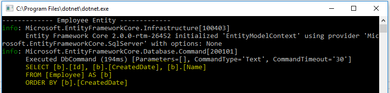
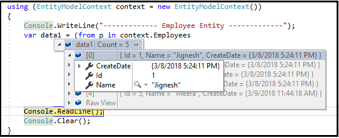
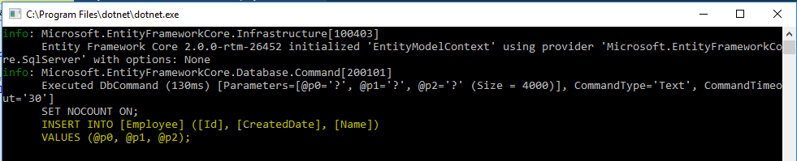
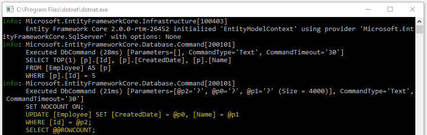

### Introduction
Entity framework core has been add many new features that already present in older entity framework version. One of the features of Entity framework core is "Shadow Properties". The feature "Shadow Properties" is originally introduced in EF 7. 

Shadow Properties are properties which are not present in our entity model class. The values can be changed and maintained by the Change Tracker API. They can also participate in LINQ to Entity query, database migration and Create/Update operation. They are very useful when data of some columns should not be exposed on the mapped entity types.

### How To define Shadow Properties
Fluent API can help us to create and configure shadow properties. They are defined at overridable events of DBcontext called "OnModelCreating".

For example, I have Employee table in database and it has three columns Id, Name and CreatedDate and my Model is exposing only two properties: Id and Name and also "CreatedDate" want to define as Shadow property. Using Following query, I have generated table and test data.

CREATE TABLE [dbo].[Employee](
	[Id] [int] NOT NULL,
	[Name] [varchar](50) NULL,
	[CreatedDate] [datetime2](7) NOT NULL,
 CONSTRAINT [PK_Employee] PRIMARY KEY CLUSTERED 
(
	[Id] ASC
)WITH (PAD_INDEX = OFF, STATISTICS_NORECOMPUTE = OFF, IGNORE_DUP_KEY = OFF, ALLOW_ROW_LOCKS = ON, ALLOW_PAGE_LOCKS = ON) ON [PRIMARY]
) ON [PRIMARY]

GO
SET ANSI_PADDING OFF
GO
INSERT [dbo].[Employee] ([Id], [Name], [CreatedDate]) VALUES (1, N'Jignesh', GETDATE())
INSERT [dbo].[Employee] ([Id], [Name], [CreatedDate]) VALUES (2, N'Rakesh', GETDATE())
INSERT [dbo].[Employee] ([Id], [Name], [CreatedDate]) VALUES (3, N'Tejas', GETDATE())
INSERT [dbo].[Employee] ([Id], [Name], [CreatedDate]) VALUES (4, N'Rajesh', GETDATE())

Employee.cs

using System.ComponentModel.DataAnnotations;
using System.ComponentModel.DataAnnotations.Schema;

namespace ShadowProperties.Model
{
    [Table("Employee")]
    public class Employee
    {
        [Key]
        public int Id { get; set; }
        public string Name { get; set; }
    }
}

When we query the employee entity, Entity Framework will automatically generate the query. To analyze the query, I just added console logging provider to DbContextOptionsBuilder.

EntityModelContext.cs

using Microsoft.EntityFrameworkCore;
using Microsoft.Extensions.Logging;
using System;

namespace ShadowProperties.Model
{
    public class EntityModelContext : DbContext
    {
        protected override void OnConfiguring(DbContextOptionsBuilder optionsBuilder)
        {
            optionsBuilder.UseSqlServer(@"Server=(local);Database=Test;user Id=sa; password=Passwd@12;");
			LoggerFactory loggerFactory = new LoggerFactory();  
			loggerFactory.AddConsole();  
			optionsBuilder.UseLoggerFactory(loggerFactory); 
        }
        protected override void OnModelCreating(ModelBuilder modelBuilder)
        {
            
        }
        public DbSet<Employee> Employees { get; set; }
    }
}

To create shadow property, the first step is to override "OnModelCreating" event of DbContext and we can define shadow property by using "Property" method of modelBuilder.Entity class. Here, if the name passed to the "Property" method matches  with the name of existing entity model class property, then Entity framework uses  this existing property rather than creating a new shadow property.

The following code helps us to create shadow properties “CreatedDate” in Employee class.

protected override void OnModelCreating(ModelBuilder modelBuilder)
{
    modelBuilder.Entity<Employee>().Property<DateTime>("CreatedDate");
    base.OnModelCreating(modelBuilder);
}

### How to use Shadow Property
As mentioned earlier, Shadow properties are not a part of entity model class and the value and state of Shadow properties are maintained by the Change Tracker API.

#### Use with Linq Query
Shadow property can also be used in LINQ query by using “EF.Property” static method. For example, the following code can be used to retrieve employee list order by created date.

var data1 = context.Employees
            .OrderBy(b => EF.Property<DateTime>(b, "CreatedDate")).ToList();

we can also retrieve shadow property with anonymous type.

var data1 = (from p in context.Employees
            select new
            {
                Id = p.Id,
                Name = p.Name,
                CreateDate = EF.Property<DateTime>(p, "CreatedDate")
            }).ToList();

#### Insert and Update value in shadow property
We can also insert/ update the value in shadow properties using “EF.Property” static method.

using (EntityModelContext context = new EntityModelContext())
{
    Employee emp = new Employee
    {
        Id = 5,
        Name = "Vishal",
    };
    context.Entry(emp).Property("CreatedDate").CurrentValue = DateTime.Now;

    context.Add(emp);
    context.SaveChanges();
}

using (EntityModelContext context = new EntityModelContext())
{
    Employee emp = context.Employees.Where(p => p.Id == 5).FirstOrDefault();
    emp.Name = "Meera";
    context.Entry(emp).Property("CreatedDate").CurrentValue = DateTime.Now;
    context.SaveChanges();
}

### Summary
Shadow Properties are properties which are not present in our entity model class. The values can be changed and maintained by the Change Tracker API. Using fluent API, we can create shadow Properties however we cannot create it using data annotations.