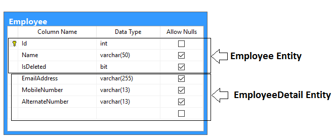
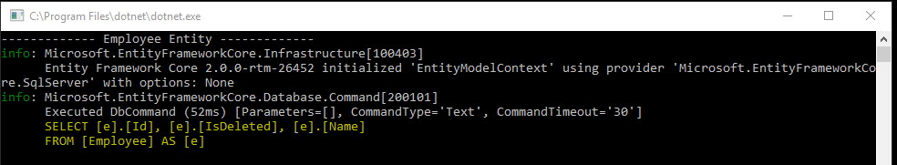
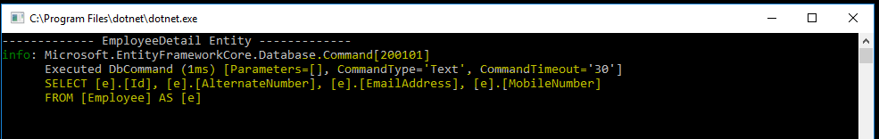
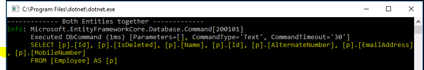
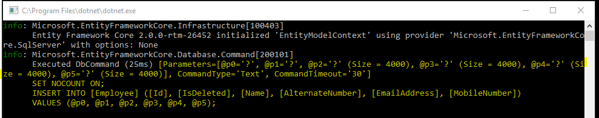
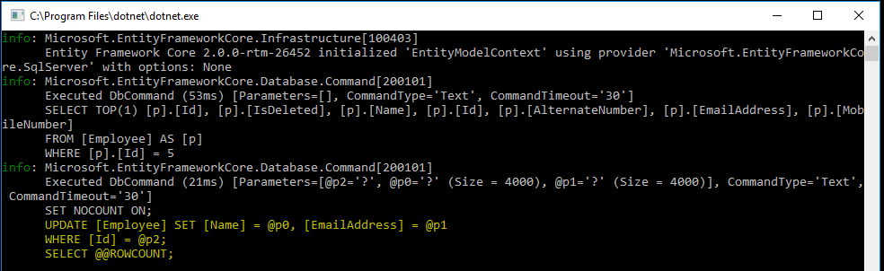
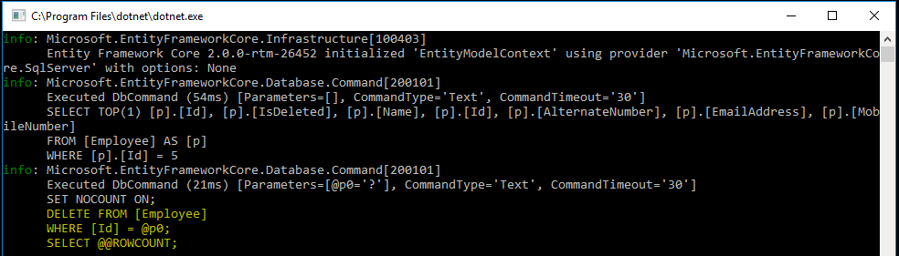

### Introduction
One of the major benefits of the Entity Framework is that our entity model does not need to match our database model. With feature Table Splitting, it possible to map multiple entities to the single database table. It means that we can split our database table to multiple entities but primary column(s) will be shared between entities. 

### Example:
I have below table in database and in entity model, I have two entities called Employee and EmployeeDetails. The Employee entity is used to store some basic information of employee and EmployeeDetails entity is used to store some additional information of employee. 



```
SET ANSI_NULLS ON
GO
SET QUOTED_IDENTIFIER ON
GO
SET ANSI_PADDING ON
GO
CREATE TABLE [dbo].[Employee](
	[Id] [int] NOT NULL,
	[Name] [varchar](50) NULL,
	[IsDeleted] [bit] NULL,
	[EmailAddress] [varchar](255) NULL,
	[MobileNumber] [varchar](13) NULL,
	[AlternateNumber] [varchar](13) NULL,
 CONSTRAINT [PK_Employee] PRIMARY KEY CLUSTERED 
(
	[Id] ASC
)WITH (PAD_INDEX = OFF, STATISTICS_NORECOMPUTE = OFF, IGNORE_DUP_KEY = OFF, ALLOW_ROW_LOCKS = ON, ALLOW_PAGE_LOCKS = ON) ON [PRIMARY]
) ON [PRIMARY]

GO
SET ANSI_PADDING OFF
GO
INSERT [dbo].[Employee] ([Id], [Name], [IsDeleted], [EmailAddress], [MobileNumber], [AlternateNumber]) VALUES (1, N'Jignesh', 0, N'jignesh@gmail.com', N'9898985864', NULL)
INSERT [dbo].[Employee] ([Id], [Name], [IsDeleted], [EmailAddress], [MobileNumber], [AlternateNumber]) VALUES (2, N'Rakesh', 0, N'rakesh@gmail.com', N'9879456987', NULL)
INSERT [dbo].[Employee] ([Id], [Name], [IsDeleted], [EmailAddress], [MobileNumber], [AlternateNumber]) VALUES (3, N'Tejas', 0, N'tejas@gmail.com', N'9879458632', NULL)
INSERT [dbo].[Employee] ([Id], [Name], [IsDeleted], [EmailAddress], [MobileNumber], [AlternateNumber]) VALUES (4, N'Rajesh', 1, N'rajesh@gmail.com', N'9426897523', NULL)
```

Following is entities definition
```
using System.ComponentModel.DataAnnotations;
using System.ComponentModel.DataAnnotations.Schema;

namespace TableSplittingExample.Model
{
    [Table("Employee")]
    public class Employee
    {
        [Key]
        public int Id { get; set; }
        public string Name { get; set; }
        public bool IsDeleted { get; set; }
        [ForeignKey("Id")]
        public EmployeeDetail EmployeeDetail { get; set; }
    }

    [Table("Employee")]
    public class EmployeeDetail
    {
        [Key]
        public int Id { get; set; }
        public string EmailAddress { get; set; }
        public string MobileNumber { get; set; }
        public string AlternateNumber { get; set; }
        public Employee Employee { get; set; }
    }
}
```
It must be configured relationship between all the entity types that sharing the table. We can configured relation between entities using HasOne (EntityTypeBuilder class) and WithOne method (ReferenceNavigationBuilder class). 
```
protected override void OnModelCreating(ModelBuilder modelBuilder)
{
    modelBuilder.Entity<Employee>().HasOne(p => p.EmployeeDetail).WithOne(p => p.Employee).HasForeignKey<Employee>(p => p.Id);
    modelBuilder.Entity<EmployeeDetail>().HasOne(p => p.Employee).WithOne(p => p.EmployeeDetail).HasForeignKey<EmployeeDetail>(p => p.Id);
    modelBuilder.Entity<Employee>().ToTable("Employee");

    base.OnModelCreating(modelBuilder);
}
```
When we query the employee and employee details entity, Entity Framework will automatically generate the query. To analyze the query, I just added console logging provider to DbContextOptionsBuilder.
```
protected override void OnConfiguring(DbContextOptionsBuilder optionsBuilder)
{
    optionsBuilder.UseSqlServer(@"Server=(local);Database=Test;user Id=sa; password=Passwd@12;");

    LoggerFactory loggerFactory = new LoggerFactory();
    loggerFactory.AddConsole();
    optionsBuilder.UseLoggerFactory(loggerFactory);
}
```
Let consider the CRUD (Create, Read, Update and Delete) scenario and check what type of query generated by entity framework.

### Select scenario

#### A. Querying on Employees Entity
When we query on employee entity, it will retrieve only columns related to the Employee entity (Id, Name and IsDeleted).
```
using (EntityModelContext context = new EntityModelContext())
{
    Console.WriteLine("------------- Employee Entity -------------");
    var data1 = context.Employees.ToList();
    Console.ReadLine();
}
```


#### B. Querying on EmployeeDetails Entity
When we query on the employee details entity, it will retrieve the columns related to the EmployeeDetail entity (Id, EmailAddress, MobileNumber, AlternateNumber).
```
using (EntityModelContext context = new EntityModelContext())
{
    Console.WriteLine("------------- Employee Entity -------------");
    var data2 = context.EmployeeDetails.ToList();
    Console.ReadLine();
}
```


#### C. Both the entities together 
When we query on both entities (Employee and EmployeeDetail), it will retrieve the columns related to both entities.
```
using (EntityModelContext context = new EntityModelContext())
{
    Console.WriteLine("------------- Employee Entity -------------");
    var data3 = context.Employees.Include(p => p.EmployeeDetail).ToList();
    Console.ReadLine();
}
```


### Insert entity scenario 
When we do an insert operation on employee and employee details entities, Entity Framework generates a single insert query for inserting the data.
```
using (EntityModelContext context = new EntityModelContext())
{
    Employee emp = new Employee
    {
        Id = 5,
        Name = "Vishal",
        IsDeleted = false,
        EmployeeDetail = new EmployeeDetail { EmailAddress = "vishal@gmail.com", MobileNumber = "895648552" }
    };

    context.Add(emp);
    context.SaveChanges();
}
```


### Update entity scenario
When we do an update operation on the employee entity or employeedetail, the Entity Framework generates a single update query with which the column has been updated. 
```
using (EntityModelContext context = new EntityModelContext())
{
    Employee emp = context.Employees.Include(p => p.EmployeeDetail).Where(p => p.Id == 5).FirstOrDefault();
    emp.Name = "Meera";
    emp.EmployeeDetail.EmailAddress = "Meera@gmail.com";
    context.SaveChanges();
}
```


### Delete entity scenario
When we do a delete operation on an employee or employee details entity, the Entity Framework generates a delete query. 
```
using (EntityModelContext context = new EntityModelContext())
{
    Employee emp = context.Employees.Include(p => p.EmployeeDetail).Where(p => p.Id == 5).FirstOrDefault();
    context.Entry<Employee>(emp).State = EntityState.Deleted;
    context.SaveChanges();
}
```


### Summary
Table splitting is one of most important feature of Entity framework core that introduced in EF core 2.0. This feature is also present in earlier version entity framework. The  advantage of Table splitting is that our entity model is very simple and straightforward and contains only the logical related fields. Table splitting can help us to improve the performance of select query. 

